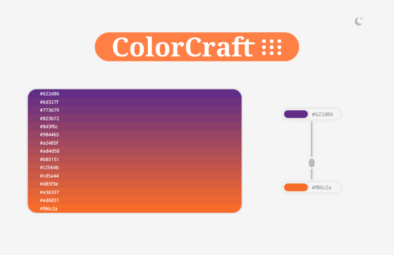

🌟👉🏻[Veja a demonstração](https://llaislara.github.io/ColorCraft/) 👈🏻🌟

Esta aplicação Vue.js permite aos usuários gerar uma paleta de cores selecionando duas cores principais e especificando o número de etapas entre elas. As cores são interpoladas para criar uma transição suave entre as cores escolhidas.

## Recursos 🛠️

- **Geração de Cores:** Os usuários podem selecionar duas cores principais e gerar uma paleta de cores interpoladas entre elas.
- **Passos Ajustáveis:** Os usuários podem especificar o número de etapas (cores) entre as duas cores principais.
- **Modo Escuro:** A aplicação suporta um tema de modo escuro, proporcionando uma experiência visual diferente para os usuários.

## Tecnologias Utilizadas 🚀

- **Vue.js:** O framework frontend usado para construir a aplicação.
- **JavaScript:** Usado para funcionalidades de script e interatividade.
- **CSS:** Fornece estilos e layout para a aplicação.

## Instalação e Configuração 🔧

Para executar este projeto localmente, siga estes passos:

1. Clone o repositório em sua máquina local.
2. Navegue até o diretório do projeto.
3. Abra o arquivo `index.html` em seu navegador da web.

## Uso 💡

1. Selecione duas cores principais usando os campos de seleção de cores.
2. Ajuste o número de etapas usando o controle deslizante para gerar mais ou menos cores entre as cores selecionadas.
3. Explore a paleta de cores gerada e ajuste conforme necessário.

### Modo Escuro 🌙

Alternar o tema de modo escuro clicando no botão de alternância de tema localizado no canto superior direito da aplicação. Isso altera as cores de fundo e de primeiro plano para criar uma experiência visual diferente.

## Licença 📝

Este projeto está licenciado sob a Licença MIT.

